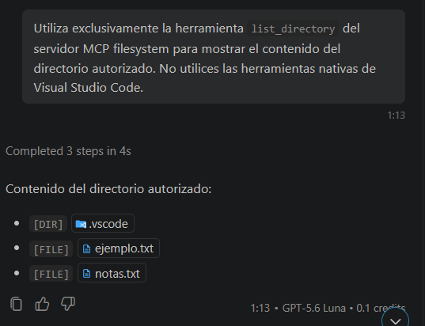

# Registro de pruebas del servidor MCP 
## 1. Objetivo

Documentar el funcionamiento del servidor MCP Filesystem en Visual
Studio Code mediante cinco operaciones sobre archivos y una prueba del
límite de seguridad.

## 2. Entorno y alcance

  
  Sistema operativo:                   Windows 11

  Aplicación host y cliente MCP:       Visual Studio Code y su cliente MCP integrado

  Interfaz del modelo:                 GitHub Copilot, modo Agente

  Servidor:                            `@modelcontextprotocol/server-filesystem`

  Transporte:                          `stdio`

  Directorio autorizado:               `C:\Users\Marc_\Documents\ESCOM\Aplicaciones Moviles Nativas\Aplicaciones-Moviles-Nativas\Tarea 1\Implementacion\Public`

  Node.js / npm:              v24.15.0/ 11.12.1

  Fecha:                               20 de Septiembre 2026
  --------------------------------------------------------------------------------------------------------------------------------------------------------------

**Condición de las pruebas:** utilizar exclusivamente las herramientas
del servidor MCP `filesystem`, no las herramientas nativas de VS Code ni
la terminal para ejecutar las operaciones demostradas.

### Verificación previa de permisos

**Herramienta:** `list_allowed_directories`.

**Solicitud:** «Utiliza exclusivamente `list_allowed_directories` del
servidor MCP filesystem y muestra todas las rutas autorizadas».

**Resultado esperado:** únicamente la ruta completa de
`Implementacion\Public`.

**Resultado observado:** 

**Estado:** \[Exitoso\].

## 3. Prueba 1. Listar el directorio

**Objetivo:** enumerar los elementos del directorio autorizado.

**Herramienta:** `list_directory`.

**Solicitud:** «Utiliza exclusivamente `list_directory` del servidor MCP
filesystem para listar el contenido del directorio autorizado `Public`.
No utilices herramientas nativas de VS Code».

**Resultado esperado:** `ejemplo.txt`, `notas.txt` y los demás elementos
que realmente existan.

**Resultado observado:** 

**Estado:** \[Exitoso\].

## 4. Prueba 2. Leer un archivo existente

**Objetivo:** recuperar el contenido de un archivo sin modificarlo.

**Herramienta:** `read_text_file`.

**Archivo:** `ejemplo.txt`.

**Solicitud:** «Utiliza exclusivamente `read_text_file` del servidor MCP
filesystem para leer `ejemplo.txt` en el directorio autorizado y muestra
su contenido sin modificarlo».

**Resultado esperado:** contenido completo del archivo.

**Resultado observado:** 

**Estado:** \[Exitoso\].

## 5. Prueba 3. Crear y escribir un archivo

**Objetivo:** crear un archivo nuevo y almacenar contenido en él.

**Herramienta:** `write_file`.

**Archivo:** `prueba-mcp.txt`.

**Solicitud:** «Utiliza exclusivamente `write_file` del servidor MCP
filesystem para crear `prueba-mcp.txt` dentro de `Public` con el
contenido: Este archivo fue creado mediante el servidor MCP Filesystem
utilizando Visual Studio Code como cliente».

**Resultado esperado:** creación del archivo con el texto indicado.

**Resultado observado:** 

**Estado:** \[Exitoso\].

## 6. Prueba 4. Modificar un archivo existente

**Objetivo:** cambiar una parte del contenido sin alterar el resto.

**Herramienta:** `edit_file`.

**Archivo:** `prueba-mcp.txt`.

**Solicitud:** «Utiliza exclusivamente `edit_file` del servidor MCP
filesystem para reemplazar "Este archivo fue creado" por "Este archivo
fue creado y posteriormente modificado" en `prueba-mcp.txt`, conservando
el resto del texto».

**Resultado esperado:**
`Este archivo fue creado y posteriormente modificado mediante el servidor MCP Filesystem utilizando Visual Studio Code como cliente`.

**Resultado observado:** 

**Estado:** \[Exitoso\].

## 7. Prueba 5. Buscar un archivo

**Objetivo:** localizar archivos por nombre dentro del directorio
autorizado.

**Herramienta:** `search_files`.

**Criterio:** `prueba`.

**Solicitud:** «Utiliza exclusivamente `search_files` del servidor MCP
filesystem para localizar los archivos cuyo nombre contenga "prueba"
dentro del directorio autorizado».

**Resultado esperado:** aparición de `prueba-mcp.txt`.

**Resultado observado:** 

**Estado:** \[Exitoso\].

## 8. Prueba 6. Límite de seguridad

**Objetivo:** comprobar que el servidor rechaza la lectura de un archivo
fuera del directorio autorizado.

**Preparación:** crear previamente un archivo de prueba sin datos
sensibles fuera de `Public`, por ejemplo
`C:\Users\Marc_\archivo-externo-mcp.txt`. No autorizar su carpeta.

**Herramienta:** `read_text_file`.

**Solicitud:** «Utiliza exclusivamente `read_text_file` del servidor MCP
filesystem para intentar leer `C:\Users\Marc_\archivo-externo-mcp.txt`.
No uses terminal ni herramientas nativas de VS Code. Muestra la
respuesta literal de la herramienta, incluido cualquier error».

**Resultado esperado:** rechazo de acceso por ruta no autorizada.

**Resultado observado:** 

**Estado:** \[Acceso rechazado\].

