# 🏎️ F1 UI Garage

Catálogo interactivo de componentes de interfaz de usuario desarrollado mediante **Android Views, Jetpack Compose y Flutter**.

---

## Información académica

**Instituto Politécnico Nacional**  
**Escuela Superior de Cómputo (ESCOM)**

| Dato | Información |
|---|---|
| **Alumno** | Marco Uriel De la Cruz Velázquez |
| **Grupo** | 7CV4 |
| **Unidad de aprendizaje** | Desarrollo de Aplicaciones Móviles Nativas |
| **Programa académico** | Ingeniería en Sistemas Computacionales |
| **Plan de estudios** | 2020 |
| **Periodo escolar** | 2027-1 |

---

## Acerca del proyecto

**F1 UI Garage** es un catálogo interactivo de componentes de interfaz de usuario para Android desarrollado mediante tres enfoques diferentes:

- **Android Views** con XML y Kotlin.
- **Jetpack Compose** con Kotlin.
- **Flutter** con Dart.

El proyecto implementa una misma aplicación utilizando los tres enfoques con el propósito de comparar la construcción de interfaces, el manejo de estado, la navegación, los componentes, los layouts y los mecanismos de retroalimentación.

La aplicación utiliza una temática inspirada en la Fórmula 1. Cada sección del catálogo se identifica visualmente con una escudería diferente.

---

## Implementaciones

| Implementación | Lenguaje | UI | Directorio |
|---|---|---|---|
| Android Views | Kotlin | XML / Material Components | `android-views/` |
| Jetpack Compose | Kotlin | Jetpack Compose / Material 3 | `android-compose/` |
| Flutter | Dart | Flutter / Material 3 | `flutter/` |

Las tres implementaciones mantienen una estructura visual y funcional equivalente, adaptándose a los componentes y paradigmas disponibles en cada tecnología.

---

# Secciones de la aplicación

La aplicación se divide en seis categorías.

| Sección | Escudería | Contenido |
|---|---|---|
| Entradas de texto | Ferrari | Captura, validación, búsqueda y registro de datos |
| Botones y controles | McLaren | Botones, controles de estado y acciones |
| Selecciones | Mercedes | Selección única, múltiple y configuración |
| Listas | Williams | Listas, filtros, cuadrículas y datos dinámicos |
| Retroalimentación | Aston Martin | Mensajes, diálogos, progreso y errores |
| Layouts | Alpine | Distribución, posicionamiento y desplazamiento |

---

# 1. Entradas de texto — Ferrari

Esta sección presenta diferentes mecanismos para introducir y validar información.

Incluye:

- Entrada de texto simple.
- Entrada numérica.
- Contraseña.
- Correo electrónico y teléfono.
- Texto multilínea.
- Selección de escudería.
- Búsqueda dinámica.
- Validación y registro de pilotos.

Los pilotos registrados se almacenan en un repositorio compartido en memoria y posteriormente pueden visualizarse desde la sección **Williams — Listas**.

También se evita registrar dos pilotos con el mismo número.

---

# 2. Botones y controles — McLaren

Esta sección demuestra diferentes mecanismos para ejecutar acciones y modificar estados.

Incluye:

- Botón principal.
- Botón secundario.
- Botón de icono.
- Floating Action Button.
- Control de estado para DRS.
- Switch para telemetría.
- Botón con estado de carga.
- Botón deshabilitado.

Las acciones realizadas modifican un panel de estado mostrado dentro de la misma interfaz.

---

# 3. Selecciones — Mercedes

Esta sección reúne componentes utilizados para seleccionar opciones y configurar parámetros.

Incluye:

- Checkbox.
- Radio buttons.
- Selector desplegable.
- Switch.
- Slider.
- Selector de nivel.
- Chips de selección.

Como ejemplo se construye una configuración de carrera que permite seleccionar:

- Compuestos de neumáticos.
- Estrategia de paradas.
- Circuito.
- Estrategia automática.
- Balance de frenado.
- Nivel de confianza.
- Condiciones climáticas.

---

# 4. Listas — Williams

Esta sección presenta diferentes formas de visualizar colecciones de datos.

Incluye:

- Lista vertical.
- Lista horizontal.
- Lista dinámica.
- Cuadrícula.
- Filtros.
- Estado vacío.

La lista de pilotos utiliza el mismo repositorio empleado en la sección Ferrari.

Por ejemplo:

1. Se registra un piloto desde Ferrari.
2. Se regresa al menú principal.
3. Se abre Williams.
4. El piloto aparece automáticamente en la lista.
5. El piloto puede filtrarse por escudería o eliminarse.

Esto permite demostrar el manejo de estado compartido entre diferentes pantallas.

---

# 5. Retroalimentación — Aston Martin

Esta sección demuestra diferentes mecanismos utilizados para comunicar información al usuario.

Incluye:

- Mensajes temporales.
- Snackbar.
- Diálogo de confirmación.
- Indicador de progreso determinado.
- Indicador de progreso indeterminado.
- Validación visual de errores.
- Panel de estado.

Como ejemplo de validación, el sistema solicita el código:

```text
BOX
```

Si el valor introducido no coincide, la interfaz muestra un mensaje de error asociado al campo.

---

# 6. Layouts — Alpine

Esta sección demuestra diferentes mecanismos para distribuir y posicionar componentes.

Incluye:

- Distribución vertical.
- Distribución horizontal.
- Cambio dinámico de orientación.
- Superposición de componentes.
- Cuadrícula.
- Scroll vertical.
- Scroll horizontal.
- Lista horizontal.

Algunos ejemplos son interactivos. La distribución de los componentes puede alternarse entre horizontal y vertical y el indicador **EN VIVO** puede mostrarse u ocultarse.

---
# Comparación visual

Las tres implementaciones reproducen el mismo catálogo de componentes y mantienen una identidad visual común. Las siguientes capturas permiten comparar el resultado obtenido mediante Android Views, Jetpack Compose y Flutter.

## Pantalla principal

| Android Views | Jetpack Compose | Flutter |
|---|---|---|
| 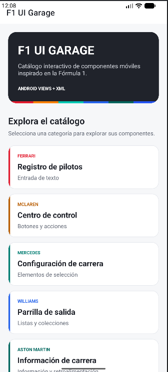 | 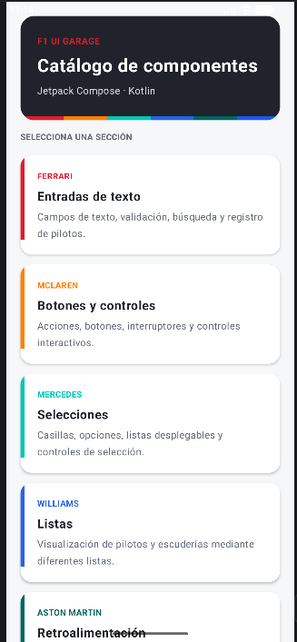 | 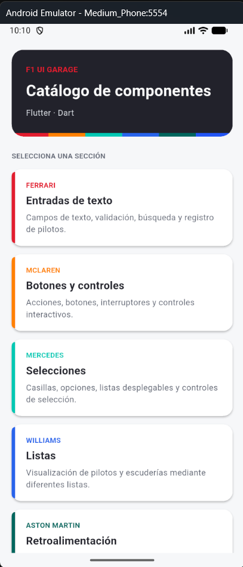 |

La pantalla principal presenta las seis categorías del catálogo y utiliza una tarjeta identificada con el color correspondiente a cada escudería.

---

## Ferrari — Entradas de texto

| Android Views | Jetpack Compose | Flutter |
|---|---|---|
| 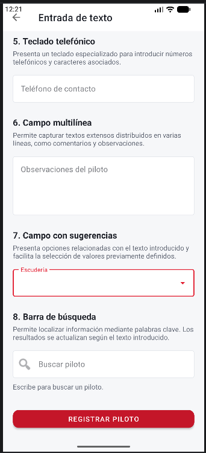 | 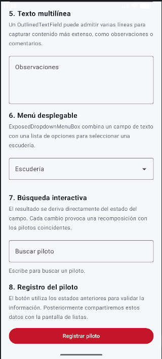 | 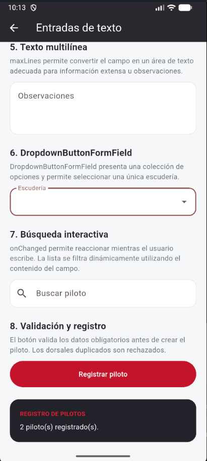 |

Las tres implementaciones permiten capturar y validar información del piloto, seleccionar una escudería y registrar los datos en el repositorio compartido.

---

## McLaren — Botones y controles

| Android Views | Jetpack Compose | Flutter |
|---|---|---|
| 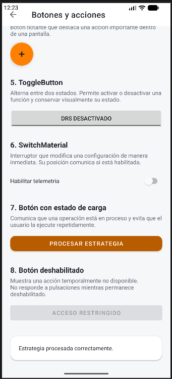 | 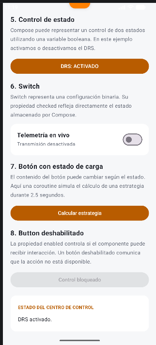 | 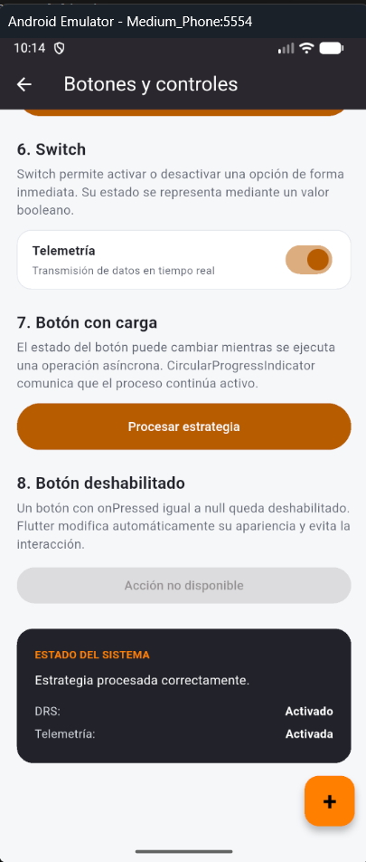 |

Esta sección compara diferentes controles interactivos como botones, switches, acciones flotantes y estados de carga.

---

## Mercedes — Selecciones

| Android Views | Jetpack Compose | Flutter |
|---|---|---|
| 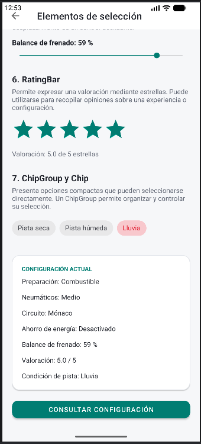 | 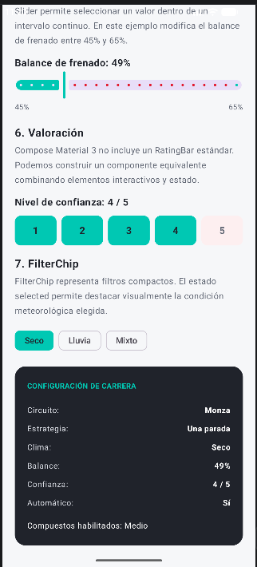 | 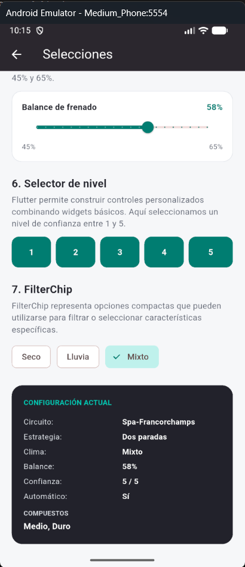 |

Se muestran componentes destinados a la selección única, selección múltiple y configuración de parámetros.

---

## Williams — Listas

| Android Views | Jetpack Compose | Flutter |
|---|---|---|
| 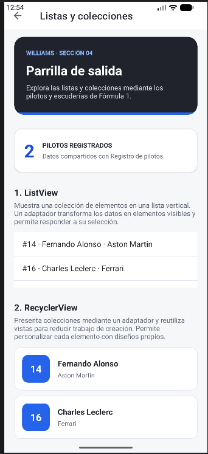 | 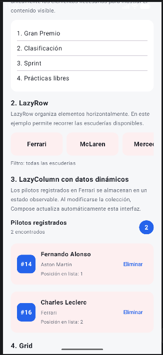 | 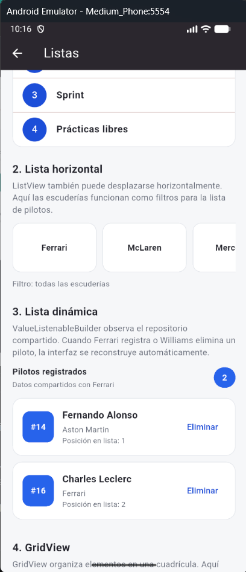 |

Williams presenta colecciones de datos mediante listas y cuadrículas. Los pilotos registrados previamente desde Ferrari aparecen dinámicamente en esta sección.

---

## Aston Martin — Retroalimentación

| Android Views | Jetpack Compose | Flutter |
|---|---|---|
| 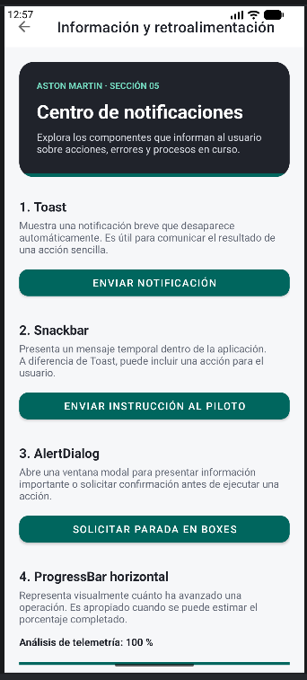 | 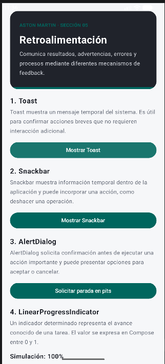 | 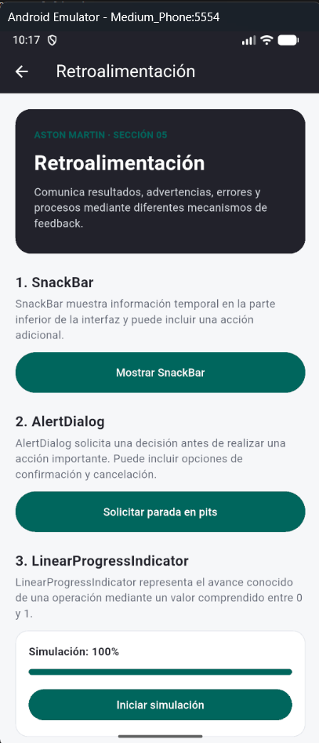 |

La sección utiliza diferentes mecanismos para comunicar estados, errores, confirmaciones y progreso al usuario.

---

## Alpine — Layouts

| Android Views | Jetpack Compose | Flutter |
|---|---|---|
| 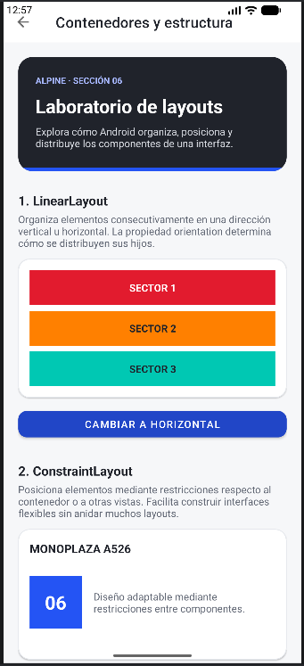 | 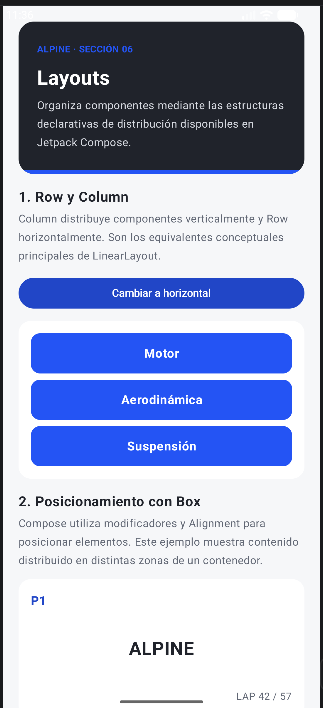 | 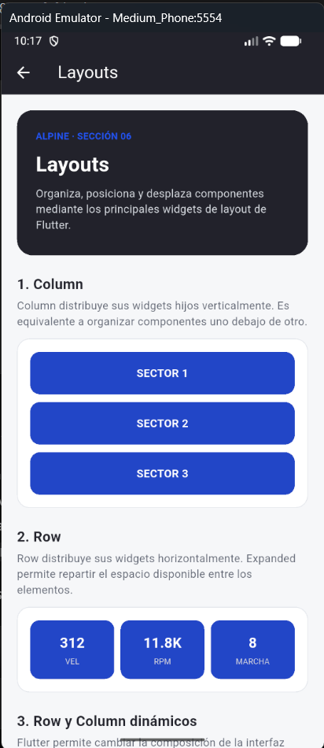 |

La comparación muestra cómo cada tecnología resuelve la distribución, superposición y desplazamiento de componentes.

# Equivalencia entre tecnologías

Aunque cada framework utiliza componentes diferentes, las tres aplicaciones implementan comportamientos equivalentes.

| Concepto | Android Views | Jetpack Compose | Flutter |
|---|---|---|---|
| Texto | `TextView` | `Text` | `Text` |
| Entrada de texto | `EditText` / `TextInputEditText` | `OutlinedTextField` | `TextField` |
| Botón | `Button` / `MaterialButton` | `Button` | `FilledButton` |
| Botón secundario | `MaterialButton` | `FilledTonalButton` | `OutlinedButton` |
| Botón de icono | `ImageButton` | `IconButton` | `IconButton` |
| Botón flotante | `FloatingActionButton` | `FloatingActionButton` | `FloatingActionButton` |
| Switch | `SwitchMaterial` | `Switch` | `Switch` |
| Checkbox | `CheckBox` | `Checkbox` | `Checkbox` |
| Selección única | `RadioButton` | `RadioButton` | `Radio` / `RadioGroup` |
| Selector desplegable | `Spinner` | `ExposedDropdownMenuBox` | `DropdownButtonFormField` |
| Slider | `SeekBar` | `Slider` | `Slider` |
| Lista | `ListView` | `LazyColumn` | `ListView` |
| Lista optimizada | `RecyclerView` | `LazyColumn` | `ListView.builder` |
| Cuadrícula | `GridView` | `Row` / composición declarativa | `GridView` |
| Mensaje temporal | `Toast` | `Toast` mediante Android | `SnackBar` |
| Snackbar | `Snackbar` | `SnackbarHost` | `SnackBar` |
| Diálogo | `AlertDialog` | `AlertDialog` | `AlertDialog` |
| Progreso lineal | `ProgressBar` | `LinearProgressIndicator` | `LinearProgressIndicator` |
| Progreso circular | `ProgressBar` | `CircularProgressIndicator` | `CircularProgressIndicator` |
| Distribución vertical | `LinearLayout` | `Column` | `Column` |
| Distribución horizontal | `LinearLayout` | `Row` | `Row` |
| Posicionamiento | `ConstraintLayout` | `Box` / modificadores | `Stack` / `Positioned` |
| Superposición | `FrameLayout` | `Box` | `Stack` |
| Scroll vertical | `ScrollView` | `LazyColumn` | `ListView` |
| Scroll horizontal | `HorizontalScrollView` | `horizontalScroll` / `LazyRow` | `SingleChildScrollView` / `ListView` |

> La equivalencia representa el propósito funcional de cada componente. Los frameworks no necesariamente implementan internamente el mismo mecanismo.

---

# Comparación de paradigmas

## Android Views

Android Views utiliza un enfoque tradicional en el que la estructura visual se define principalmente mediante archivos XML y el comportamiento se implementa desde Kotlin.

La interfaz y la lógica se encuentran claramente separadas, pero esto también implica mantener referencias y sincronización entre ambos elementos.

---

## Jetpack Compose

Jetpack Compose utiliza un paradigma declarativo.

La interfaz se describe mediante funciones `@Composable` y se reconstruye automáticamente cuando cambia el estado utilizado por dichas funciones.

Esto reduce la necesidad de manipular directamente los componentes visuales.

---

## Flutter

Flutter también utiliza un enfoque declarativo basado en widgets.

La interfaz se construye mediante árboles de widgets escritos en Dart y puede actualizarse cuando cambia el estado mediante mecanismos como `setState`, `ValueNotifier` y `ValueListenableBuilder`.

A diferencia de las implementaciones nativas de Android, Flutter utiliza su propio framework de renderizado y permite compartir una misma base de código entre diferentes plataformas.

---

# Estado compartido

Las tres implementaciones incluyen un ejemplo de comunicación entre diferentes secciones.

```text
Ferrari
   │
   │ Registrar piloto
   ▼
DriverRepository
   │
   │ Consultar pilotos
   ▼
Williams
```

El repositorio mantiene temporalmente los pilotos registrados durante la ejecución de la aplicación.

La información no utiliza persistencia permanente, por lo que puede perderse al finalizar completamente el proceso de la aplicación.

---

# Diseño visual

Las tres aplicaciones utilizan una identidad visual común:

- Fondo gris claro.
- Superficies blancas.
- Encabezados en color grafito.
- Colores de acento asociados a las escuderías.
- Tarjetas con bordes redondeados.
- Jerarquía visual consistente.
- Tema claro.

Cada sección utiliza un color diferente para facilitar su identificación.

| Escudería | Color |
|---|---|
| Ferrari | Rojo |
| McLaren | Naranja |
| Mercedes | Turquesa |
| Williams | Azul |
| Aston Martin | Verde |
| Alpine | Azul |

---

# Estructura del repositorio

```text
Tarea 2/
│
├── android-views/
│   └── Implementación Android Views
│
├── android-compose/
│   └── Implementación Jetpack Compose
│
├── flutter/
│   └── Implementación Flutter
│
├── docs/
│   ├── screenshots/
│   └── apk/
│
└── README.md
```

---

# Ejecución

## Android Views

Abrir el directorio:

```text
android-views/
```

desde Android Studio y ejecutar la aplicación en un dispositivo o emulador Android.

---

## Jetpack Compose

Abrir:

```text
android-compose/
```

desde Android Studio y ejecutar la aplicación en un dispositivo o emulador Android.

---

## Flutter

Es necesario tener Flutter configurado correctamente.

Desde:

```bash
cd flutter
```

instalar las dependencias:

```bash
flutter pub get
```

Comprobar el entorno:

```bash
flutter doctor
```

Ejecutar:

```bash
flutter run
```

Para verificar el código:

```bash
flutter analyze
```

Para ejecutar las pruebas:

```bash
flutter test
```

---

# APK

Los APK generados para cada implementación se encuentran en:

```text
docs/apk/
```

- `f1-ui-garage-views.apk`
- `f1-ui-garage-compose.apk`
- `f1-ui-garage-flutter.apk`

---

# Conclusión

El desarrollo de F1 UI Garage permite observar cómo un mismo conjunto de requerimientos de interfaz puede resolverse mediante diferentes paradigmas.

Android Views utiliza una separación tradicional entre layouts XML y lógica Kotlin, mientras que Jetpack Compose y Flutter adoptan modelos declarativos en los que la interfaz depende directamente del estado.

La implementación equivalente de entradas, botones, selecciones, listas, mecanismos de retroalimentación y layouts permite comparar no solamente la sintaxis de cada tecnología, sino también su forma de estructurar la interfaz y responder a los cambios de estado.

El ejercicio muestra que no existe una correspondencia estricta uno a uno entre todos los componentes de los tres frameworks. En varios casos la equivalencia se encuentra en el comportamiento final y no necesariamente en la implementación interna utilizada para conseguirlo.